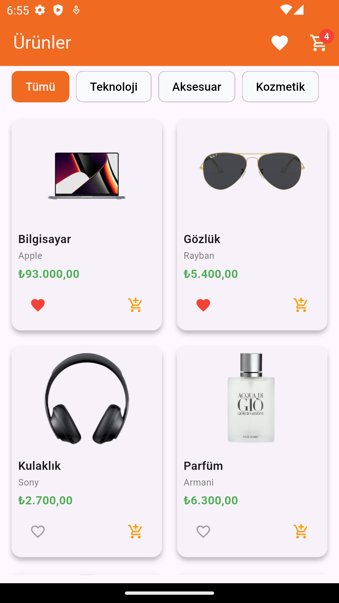
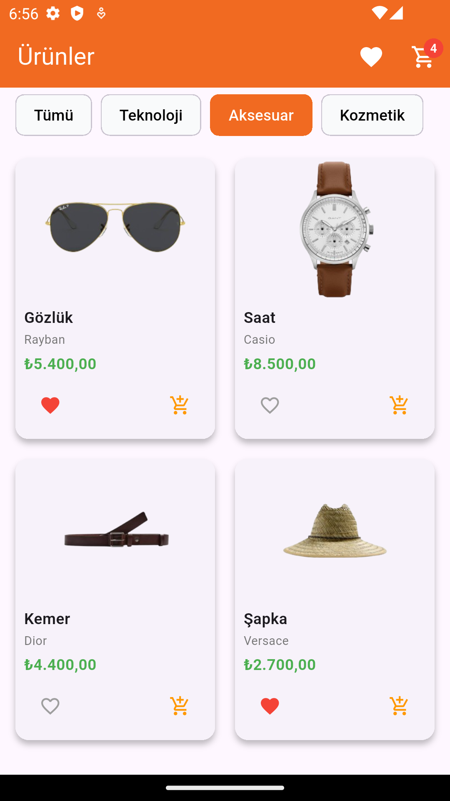
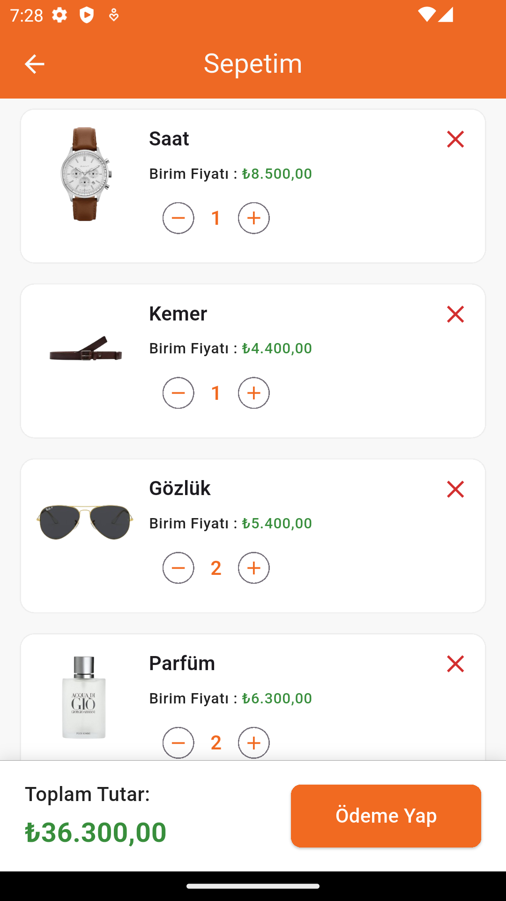
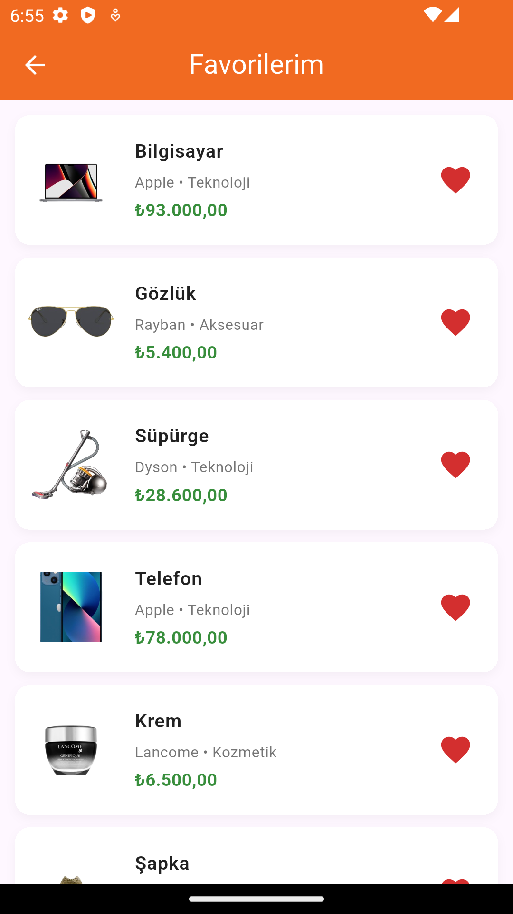

# 🛒 Vira E-Ticaret Uygulaması

### EN:  
This repository contains a sample **E-Commerce mobile application** project developed with Flutter named **Vira**.

In this project, I built a dynamic and modern mobile shopping app interface, with features like product listing, cart management, favorites, and payment summary screens.

What I learned & used:

🎯 Effectively applied **Bloc architecture (Bloc, Event, State)** for state management  
📦 Created **Repository** and **Service** layers for clean and scalable architecture  
📡 Used **Dio** for REST API data fetch and send operations  
❤️ Implemented **SQLite (sqflite)** for local favorites management  
💸 Used **intl package** for price formatting  
🧩 Structured my code into organized folders for each feature: `bloc`, `model`, `service`, `repository`, `view`  
🎨 Built a modern, clean and professional UI  

---

### TR:  
Bu repo, **Vira** adlı Flutter ile geliştirdiğim örnek bir **E-Ticaret mobil uygulama projesidir**.

Bu projede, ürün listeleme, sepete ekleme, favorilere kaydetme ve ödeme özeti ekranlarını içeren modern ve dinamik bir mobil alışveriş uygulaması arayüzü oluşturdum.

Öğrendiklerim ve kullandıklarım:

🎯 **Bloc mimarisi (Bloc, Event, State)** ile state yönetimini uyguladım  
📦 Temiz ve ölçeklenebilir yapı için **Repository** ve **Service** katmanları oluşturdum  
📡 **Dio** ile REST API üzerinden veri çekme ve gönderme işlemleri gerçekleştirdim  
❤️ **SQLite (sqflite)** ile favorilere ekleme ve yönetme işlemlerini yaptım  
💸 **intl paketi** ile fiyat formatlama işlemlerini düzenledim  
🧩 Her özellik için `bloc`, `model`, `service`, `repository`, `view` klasör yapısı oluşturarak düzenli kod geliştirdim  
🎨 Modern, sade ve profesyonel bir UI arayüz tasarladım  

---

## 📸 Ekran Görüntüleri  

### 🏠 Ana Sayfa

  
  &nbsp;&nbsp;
  

  

### 🛒 Sepet ve ❤️ Favoriler

  
  &nbsp;&nbsp;
  

